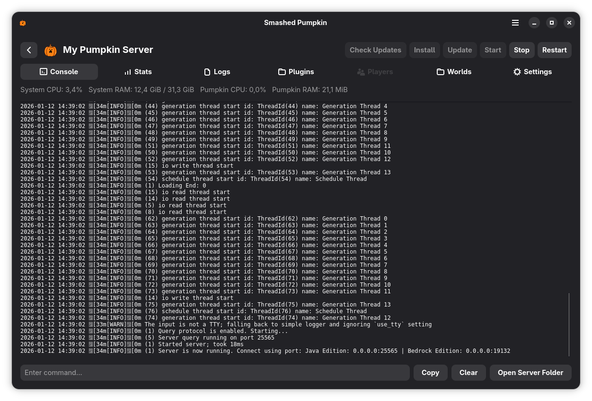
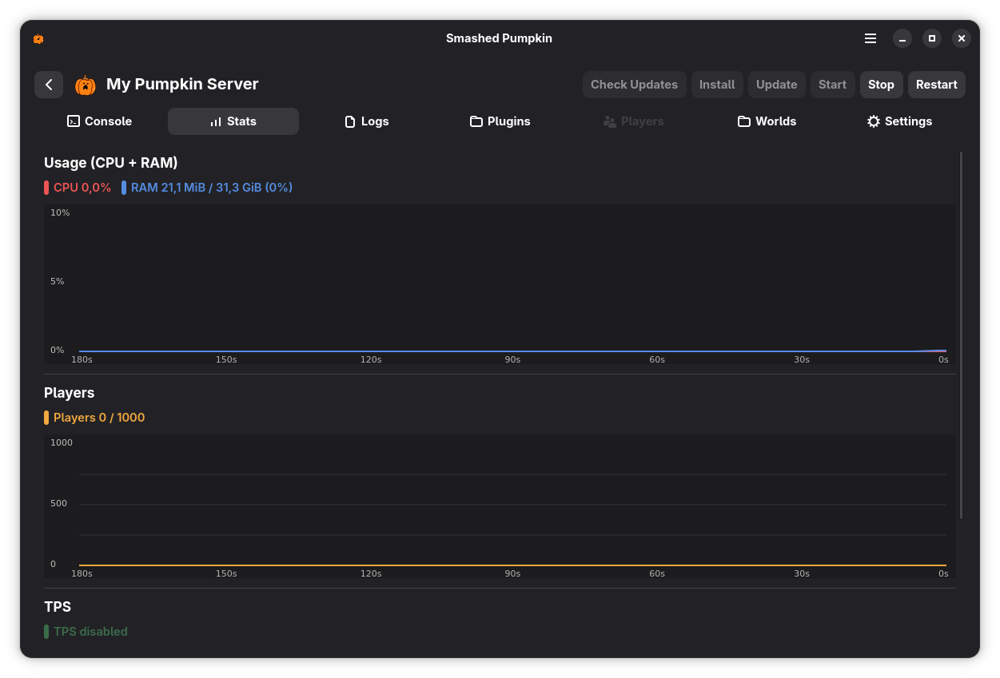
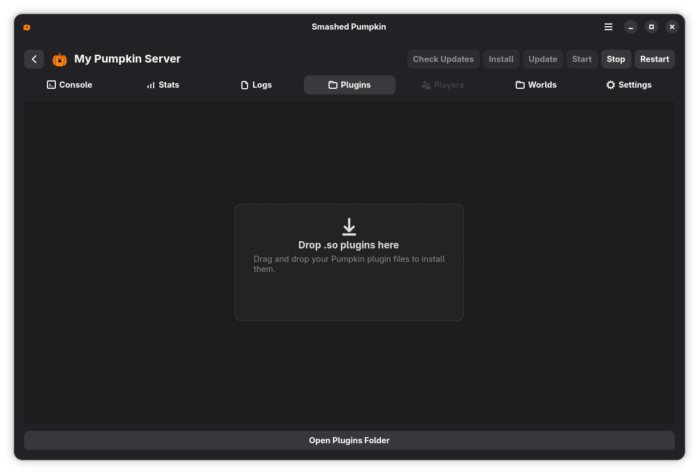
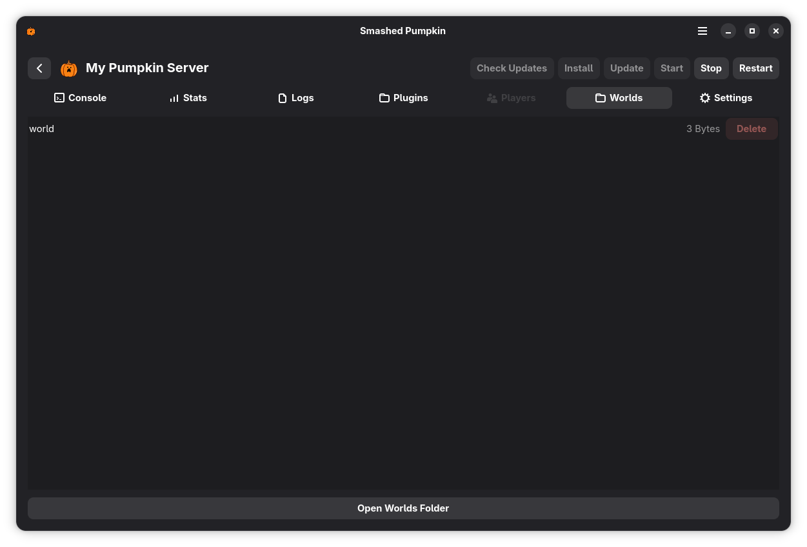
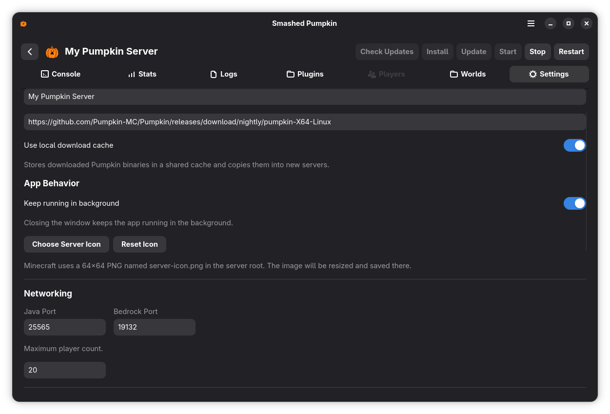

<h1> Smashed Pumpkin</h1>

Manage PumpkinMC servers with a modern GNOME desktop app.

## Get it
```
https://flathub.org/apps/dev.rotstein.SmashedPumpkin
```

## Build (Meson)
```bash
meson setup buildDir
meson compile -C buildDir
./buildDir/src/smashed-pumpkin
```

## Screenshots







## License
GPL-3.0-or-later. See `LICENSE`.
