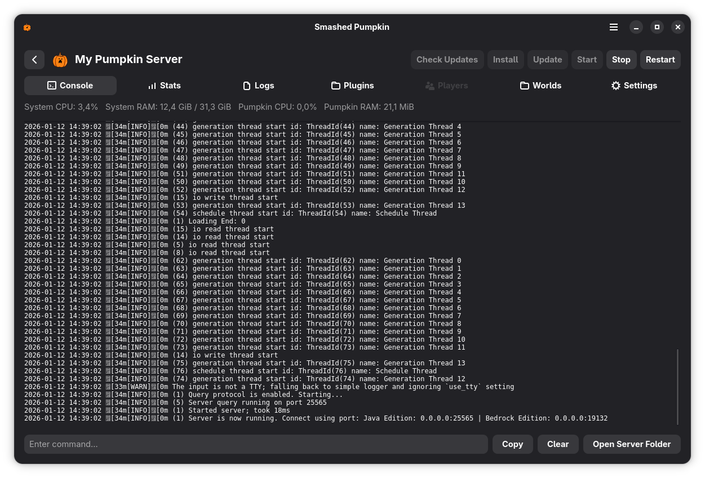
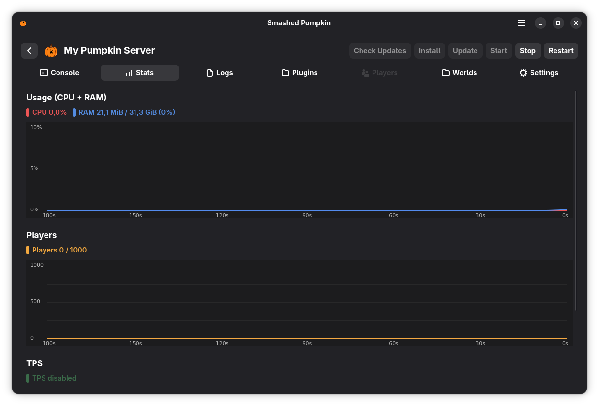
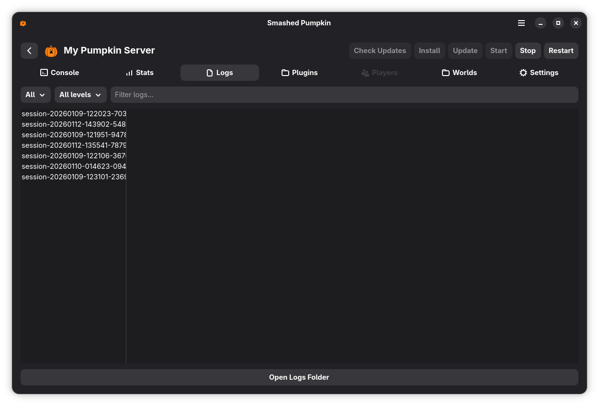
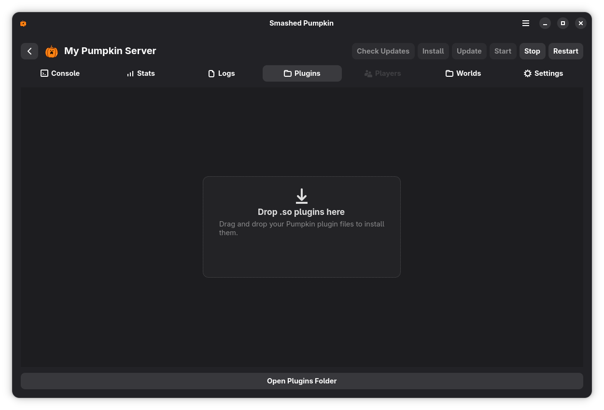
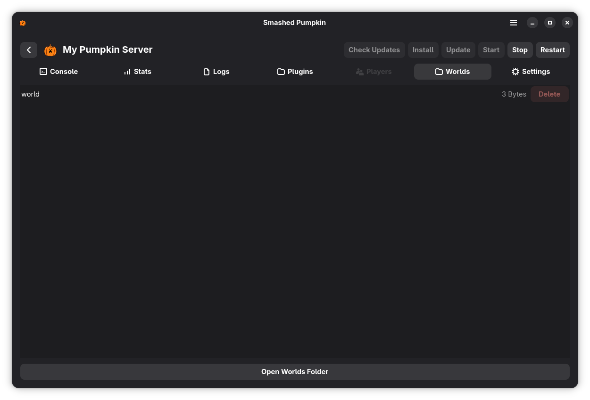
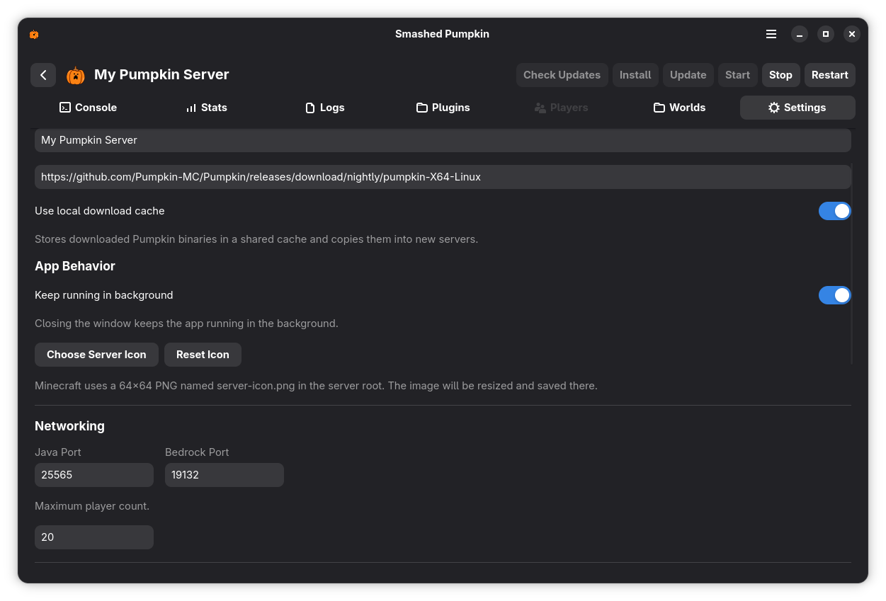

<h1> Smashed Pumpkin</h1>

Smashed Pumpkin is a GNOME-style desktop manager for Pumpkin Minecraft servers.
It helps you run, update, and manage standalone servers or full server networks from one place.
The app is 100% free and open source.

## Download

### Linux
```bash
flatpak install flathub dev.rotstein.SmashedPumpkin
```

### Windows
```powershell
winget install Rotstein.SmashedPumpkin
```

### macOS
- Apple Silicon (ARM64): [Download](https://nightly.link/Rotstein007/smashed-pumpkin/workflows/desktop-builds/master/smashed-pumpkin-macos-arm64.zip)
- Intel (x64): [Download](https://nightly.link/Rotstein007/smashed-pumpkin/workflows/desktop-builds/master/smashed-pumpkin-macos-x64.zip)

## Build it yourself (short)
```bash
meson setup buildDir
meson compile -C buildDir
./buildDir/src/smashed-pumpkin
```

## Tray icon on GNOME
GNOME Shell does not show legacy tray icons by default.
Install and enable the `AppIndicator and KStatusNotifierItem Support` extension to see the tray icon.

## Screenshots







## License
GPL-3.0-or-later. See `LICENSE`.
