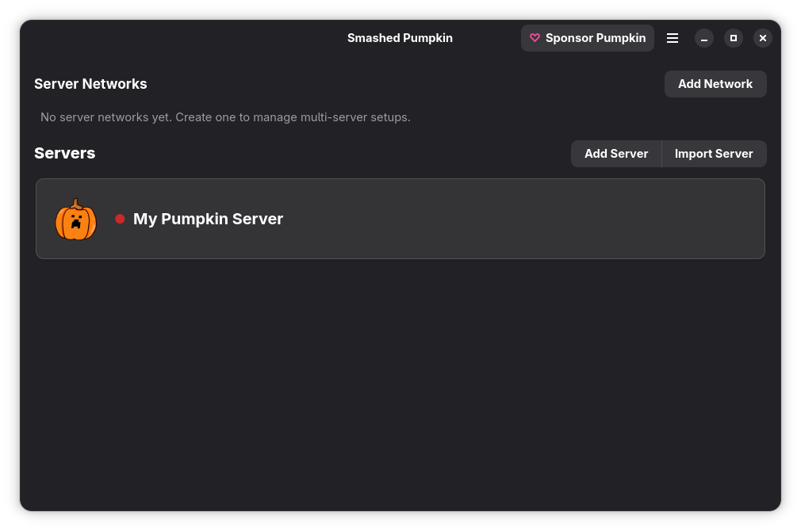
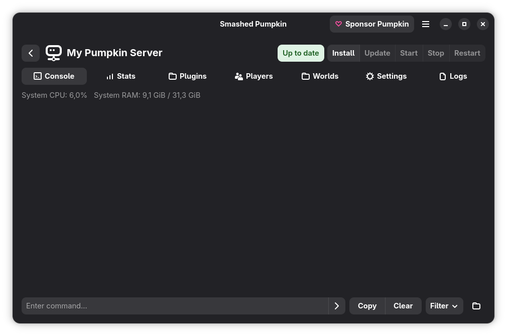
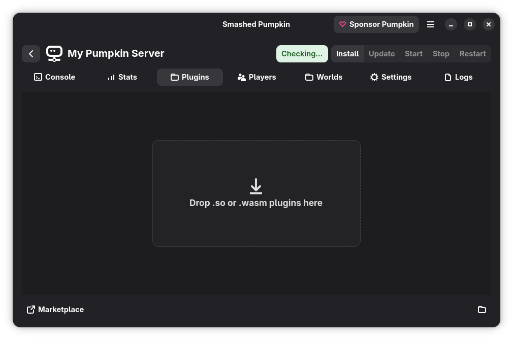

<h1> Smashed Pumpkin</h1>

Smashed Pumpkin is a GNOME-style desktop manager for Pumpkin Minecraft servers.
It helps you run, update, and manage standalone servers or full server networks from one place.
The app is 100% free and open source.

## Download

### Linux
```bash
flatpak install flathub dev.rotstein.SmashedPumpkin
```

### Windows
```powershell
winget install Rotstein.SmashedPumpkin
```

### macOS
- Apple Silicon (ARM64): [Download](https://nightly.link/Rotstein007/smashed-pumpkin/workflows/desktop-builds/master/smashed-pumpkin-macos-arm64.zip)
- Intel (x64): [Download](https://nightly.link/Rotstein007/smashed-pumpkin/workflows/desktop-builds/master/smashed-pumpkin-macos-x64.zip)

## Build it yourself
```bash
meson setup buildDir
meson compile -C buildDir
./buildDir/src/smashed-pumpkin
```

## Windows signing
To remove the "unverified publisher" warning for normal users, the Windows release pipeline supports code signing in GitHub Actions.

Add these repository secrets:
- `WINDOWS_SIGNING_CERT_BASE64`
  Base64-encoded `.pfx` certificate
- `WINDOWS_SIGNING_CERT_PASSWORD`
  Password for the `.pfx`
- `WINDOWS_SIGNING_TIMESTAMP_URL`
  Optional timestamp server URL. If omitted, the workflow uses `http://timestamp.digicert.com`

When those secrets are present, the workflow signs:
- `smashed-pumpkin.exe`
- `smashed-pumpkin-tray.exe`
- the generated Windows `.msi`

## Screenshots




## License
GPL-3.0-or-later. See `LICENSE`.
